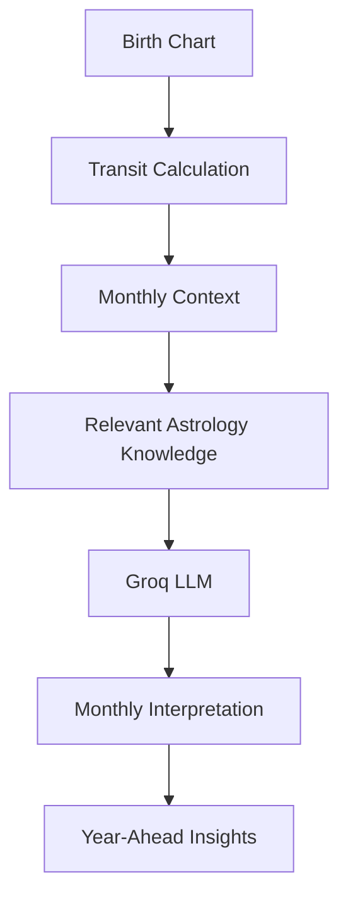

# 🔮 PrashnaAI

## AI-Powered Personalized Astrology Intelligence Platform

PrashnaAI is a **Generative AI-powered astrology application** that combines structured astrological calculations, numerology, Retrieval-Augmented Generation (RAG), semantic search, and Large Language Models (LLMs) to generate personalized astrology insights.

Unlike a traditional astrology chatbot that simply answers questions, PrashnaAI is designed around an individual's **birth date, birth time, and birth place**. The application calculates relevant astrological information, retrieves supporting knowledge from an astrology-focused knowledge base, and uses an LLM to transform that information into personalized interpretations, predictions, relationship insights, and practical advice.

> **Core Domains:** Generative AI · LLMs · RAG · NLP · Semantic Search · AI Personalization

---

# ✨ Key Features

## 🌌 Personalized Astrology Analysis

PrashnaAI uses individual birth information to generate a personalized astrological profile.

The application works with:

- Date of birth
- Time of birth
- Birth place
- Ascendant
- Planetary positions
- Moon sign
- Nakshatra-related information
- Other calculated chart information

The generated interpretation is based on the individual's calculated chart rather than a generic zodiac horoscope.

---

## 🔢 Numerology

PrashnaAI also incorporates numerology into the personalized analysis.

The system calculates values such as:

- **Mulyank**
- **Bhagyank**

These values can be combined with the astrological information to provide additional personalized interpretations.

---

# 🔮 Personalized Predictions

PrashnaAI generates AI-based interpretations across different areas of life.

Depending on the supported modules, these can include:

- 💼 Career
- 💰 Finance
- ❤️ Relationships
- 🌱 Personal growth
- 🧠 Personality and tendencies
- 📅 Year-ahead insights

Each area is generated using the individual's structured chart information and relevant retrieved knowledge.

The goal is to avoid returning the same generic horoscope to every user.

---

# ❤️ Relationship Analysis

PrashnaAI includes a dedicated relationship and compatibility module.

The system supports both:

### Individual Relationship Advice

The application can generate personalized relationship-oriented guidance based on the user's chart.

### Two-Person Compatibility

Users can enter the birth information of two people and compare their charts.

```text
              PERSON A
                  │
          Birth Information
                  │
                  ▼
             Chart A
                  │
                  │
          Compatibility
             Analysis
                  │
                  │
             Chart B
                  ▲
          Birth Information
                  │
              PERSON B
___________________________________________________________________________________________________________________________
## 📅 Year-Ahead Analysis

PrashnaAI includes a year-ahead analysis workflow based on calculated transit information and AI-generated narratives.

The system generates month-oriented interpretations to help users explore astrological themes across the upcoming year.



